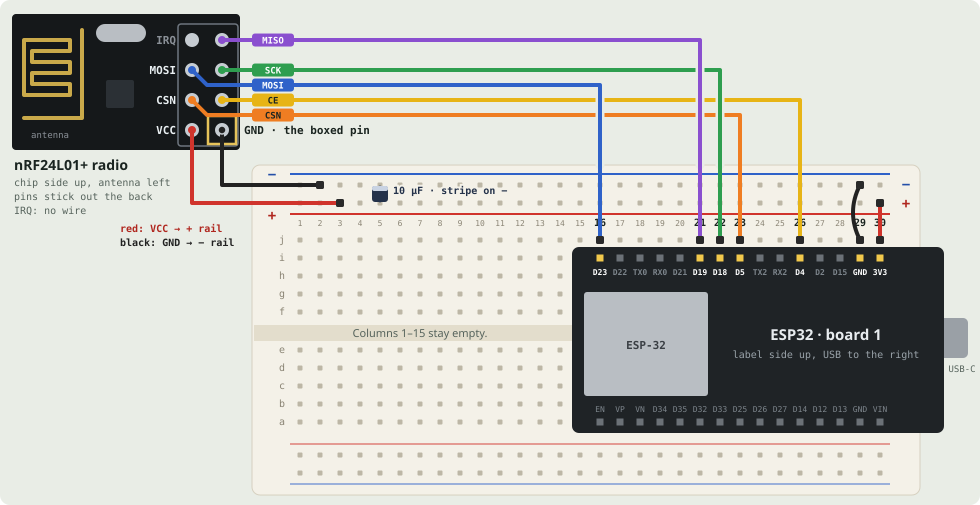

# Fledge 🐣

Fly a toy drone (FunPX SQN-053) from an iPhone:

    iPhone app --Bluetooth--> ESP32 --SPI--> nRF24L01+ --2.4 GHz--> drone

The ESP32 and radio form a small **relay** between the phone and the
drone. The drone itself is not modified.

## Where it's at

- **Works:** the iPhone app (tilt to fly, a ring to turn, an up/down
  slider, Fly/Stop, take off, lights, speed, flip, motors off), and the
  Bluetooth link from the app to the relay.
- **Worked out:** how the drone's remote talks to it (see
  [SNIFFING.md](firmware/SNIFFING.md)).
- **Not yet:** the relay sending to the drone. Today it receives the
  phone's controls and prints them.

## Build your own

1. **Buy the parts:** [below](#buying-the-parts).
2. **Install the Arduino tools and check the ESP32:**
   [SETUP.md](firmware/SETUP.md), steps 1-2.
3. **Put the relay on the ESP32 and test it:**
   [firmware/README.md](firmware/README.md#the-relay-relay). This needs
   only the ESP32 on USB.
4. **Build the iPhone app:** [below](#building-the-iphone-app).
5. **Wire the radio** (for talking to the drone, and for the bench
   tools): [below](#wiring-the-radio).

## Buying the parts

These are the exact listings used (search for the names). One of each
pack is needed; the spares are handy if a part gets damaged.

| Part | Listing | Used for |
|------|---------|----------|
| ESP32 boards | **ELEGOO 3PCS ESP-32 Dev Boards, ESP-WROOM-32, USB-C, WiFi Bluetooth 4.2** | The relay: talks to the phone over Bluetooth and to the radio over SPI |
| Radios | **HiLetgo 4pcs NRF24L01+ Wireless Transceiver Module, 2.4G** | Talks to the drone (the small PCB-antenna version, with a 2x4 pin header) |
| Kit | **ELEGOO Electronic Fun Kit Bundle with Breadboard, 235 Items for Arduino** | The breadboard, female-to-male jumper wires and the 10 µF capacitor |

Plus the drone (FunPX SQN-053, with its remote), a USB-C cable that
carries data, and an iPhone with iOS 26 (built on an iPhone 13; it uses
the motion sensors, the barometer and Bluetooth LE).

**Why this ESP32 works with an iPhone.** An iPhone app can only talk to
a homemade gadget over **Bluetooth Low Energy (BLE)**; classic Bluetooth
serial needs Apple's MFi certification. The ESP-WROOM-32 chip on these
boards has Bluetooth 4.2 with BLE, so the app can connect to it directly.
Any board built on the original ESP32, ESP32-S3 or ESP32-C3 would work
too, but **not the ESP32-S2, which has no Bluetooth**.

**Why these boards suit a Mac.** Their USB-serial chip is a CP2102, which
macOS supports out of the box: no driver to install. They have USB-C, and
reset themselves for uploading, so the BOOT button is never needed. Use a
USB cable that carries data; a charge-only cable powers the board, but
the Mac never sees it.

The drone's radio is an XN297 (or a copy) at 1 Mbps, which the
nRF24L01+ can read; see [SNIFFING.md](firmware/SNIFFING.md).

## Wiring the radio

One nRF24L01+ radio on seven jumper wires, a 30-pin ESP32 on a
half-size breadboard, and a 10 µF capacitor. This exact layout, with
these wire colours, was built and worked first time. Keep to the colours:
they make every wire easy to trace from pin to hole.

**Keep the USB cable unplugged while you wire.**

### Every wire

| From | Wire | To | What it does |
|------|------|----|--------------|
| ESP32 3V3 (j30) | red | + rail | Feeds 3.3 V to the rail |
| ESP32 GND (j29) | black | − rail (outer row, blue line) | Shared ground |
| Radio VCC | red | + rail, column 3 | Power, 3.3 V |
| Radio GND (the boxed pin) | black | − rail, column 2 | Ground |
| Radio CE | yellow | j26 (GPIO 4) | Switches the radio between listening and idle |
| Radio CSN | orange | j23 (GPIO 5) | Tells the radio "I'm talking to you now" |
| Radio SCK | green | j22 (GPIO 18) | Clock that keeps the two chips in step |
| Radio MISO | purple | j21 (GPIO 19) | Data from the radio to the ESP32 |
| Radio MOSI | blue | j16 (GPIO 23) | Data from the ESP32 to the radio |
| Radio IRQ | none | nothing | Not needed |
| 10 µF capacitor | — | top rails, column 5 | Long leg on +, striped leg on −. Smooths the radio's power bursts, which otherwise cause random dropouts |

The radio's wires are female-to-male: the female end goes on the radio's
pin (its 2x4 block can't go in a breadboard), the male end into the
breadboard.

### Build order

1. Hold the ESP32 label side up, USB socket to the **right**. Line up
   its `D23 … GND 3V3` row with **row i, columns 16-30**: D23 over i16,
   3V3 over i30. The other row lands in row a. Press down gently and
   evenly; new breadboards are stiff.
2. Red jumper from **j30** to the **+** rail just above it. Black jumper
   from **j29** to the **−** rail, the outer row with the blue line.
3. Capacitor across the top rails near **column 5**: long leg in +,
   striped short leg in −.
4. Hold the radio **chip side up, antenna on the left**, as drawn. Its
   pins stick out of the back, where left and right are swapped, so keep
   it chip side up and push each wire on from behind. **GND is the
   bottom-right pin, the one with its own printed box.**
5. Plug in the radio's seven wires as in the table.

Leave the kit's breadboard power supply module in the box: the ESP32
already powers the rails, and the module can put 5 V on them.

### Check before plugging in USB

The red and black wires are the ones that can destroy the radio.

- Radio VCC goes to the 3V3 rail: **not 5V, not VIN**.
- Black on the radio's boxed pin (GND), red on the pin beside it (VCC).
- The ESP32's 3V3 pin feeds the + rail, not its 5V or VIN pin, and
  nothing is in the VIN column (column 30 on the row-a side).
- Capacitor stripe on the − rail: a backwards electrolytic capacitor can
  pop.
- Each signal wire is in row j of the right column: one column off puts a
  signal on the wrong pin.
- The radio isn't lying on anything metal, and no bare wire ends touch.
- The USB cable carries data, not only charge.

### Next

Plug in the USB cable and check the radio with RadioCheck:
[SETUP.md, step 4](firmware/SETUP.md#4-check-the-radio-with-radiocheck).

## Building the iPhone app

You need a Mac with Xcode, [XcodeGen](https://github.com/yonaskolb/XcodeGen)
(`brew install xcodegen`) and an Apple account (a free one works; the
app then has to be reinstalled every 7 days).

1. Signing: copy `ios/Local.xcconfig.example` to `ios/Local.xcconfig`
   and put your Apple team ID in it (Xcode → Settings → Accounts → your
   team). Git ignores this file, so your team ID stays private.
2. Create the Xcode project, which is generated from `ios/project.yml`
   rather than kept in git:

       cd ios
       xcodegen

3. Open `ios/Fledge.xcodeproj` in Xcode, pick your iPhone, and press Run.
   The simulator can't test Bluetooth, so use a real phone.

New files added to `ios/Fledge/` join the app automatically. Run
`xcodegen` again only when `project.yml` changes.

## Changing how Fledge flies

Open [ios/Fledge/Tuning.swift](ios/Fledge/Tuning.swift), change a number,
colour or emoji, then build and run again. One setting per line, each
with a short note on what it does.

## What's where

| Path | What |
|------|------|
| [ios/](ios/) | The iPhone app (Swift, SwiftUI) |
| [ios/Fledge/Tuning.swift](ios/Fledge/Tuning.swift) | Every setting you might want to change |
| [firmware/](firmware/README.md) | The ESP32 relay, and the bench tools used to decode the remote |
| [firmware/SETUP.md](firmware/SETUP.md) | Arduino tools, checking the boards and the radio |
| [firmware/SNIFFING.md](firmware/SNIFFING.md) | How the remote's radio was worked out |
| [PROTOCOL.md](PROTOCOL.md) | The messages the app sends the relay |
